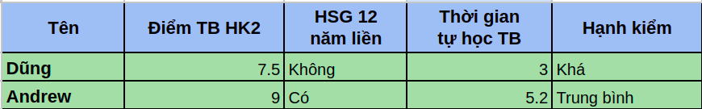
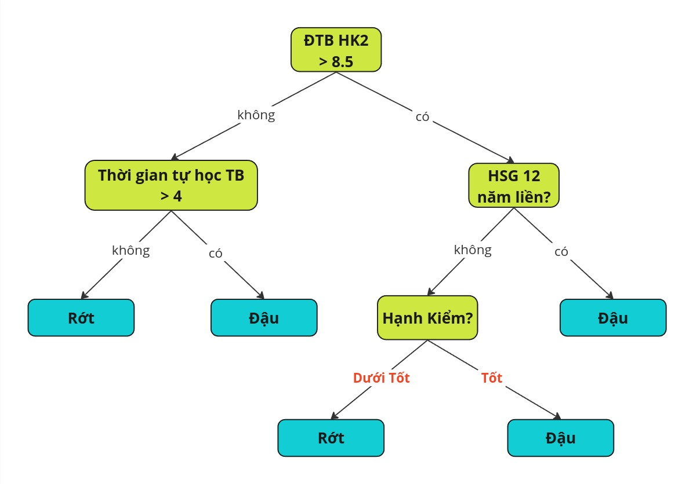
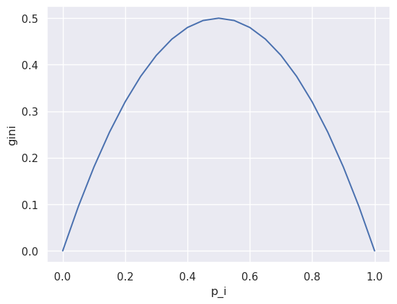
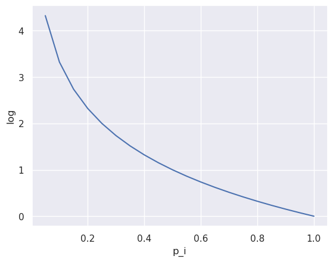
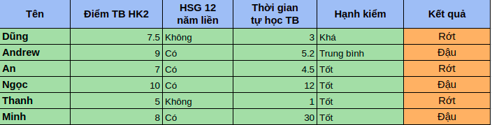
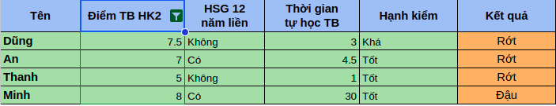
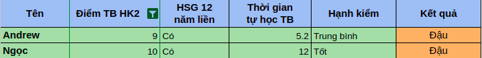
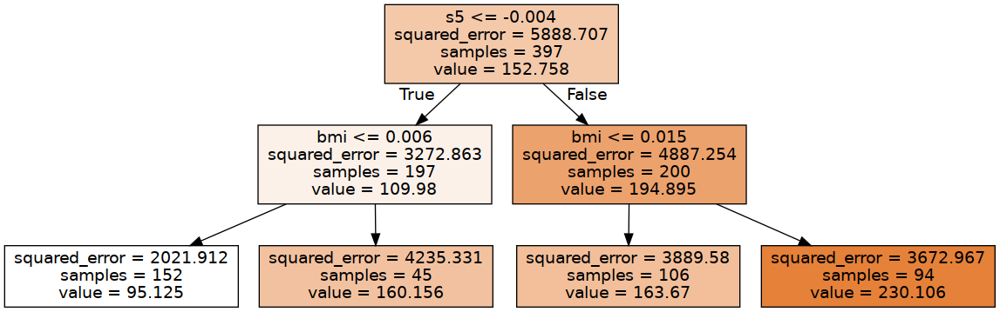
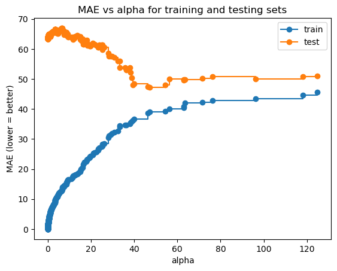

***Lưu ý:** một số thuật ngữ liên quan đến thuật toán trong bài viết này sẽ không được dịch ra tiếng Việt*

# 1. Khái niệm về cây quyết định
Giả sử bạn có một bảng dữ liệu về thông tin học tập của tất cả học sinh cấp 3 trên cả nước năm trước, với các cột là dữ liệu về điểm thi học kì, số giờ học trung bình,... và kết quả thi tốt nghiệp THPT năm ngoái. Mục tiêu của bạn là dựa trên những dữ liệu này mà dự đoán được kết quả thi tốt nghiệp THPT sắp tới của các học sinh năm nay. Với Machine Learning, chúng ta có một thuật toán hiệu quả để dự đoán kết quả dựa trên dữ liệu đã có như này dưới dạng xét từng attribute và đưa quyết định cuối cùng, đó là Cây quyết định (Decision Tree).<br>
<br>

Vậy Decision Tree là gì? Nếu bạn đã từng học môn Cấu trúc Dữ liệu và Giải thuật ở Đại học, thì Decision Tree chỉ cơ bản là một cây với những node lưu attribute và giá trị xét cho attribute đó, và mỗi nhánh tách ra là đường đi tiếp theo của dữ liệu nếu đạt yêu cầu cho node đó. Tôi đoán là tôi giải thích hơi khó hiểu, nếu là vậy thì bạn hãy xem ví dụ sau.<br>

OK, giả sử chúng ta có dữ liệu (tự bịa ra) về thông tin của 2 học sinh cấp 3 chuẩn bị thi Tốt nghiệp như sau:<br>

<br>

Và chúng ta cũng có sẵn một Cây quyết định dự đoán xem 2 học sinh này sẽ đậu hay rớt. <br>


Nếu chúng ta duyệt từng attribute của 2 học sinh qua cây thì dễ dàng thấy được là Andrew sẽ đậu còn Dũng sẽ rớt. Như vậy, mỗi node của cây quyết định chứa attribute và giá trị xét tại node đó. Lấy root node làm ví dụ "*ĐTB HK2*" là attribute đang xét và "*> 8.5*" (lớn hơn 8.5) là giá trị đang xét. Bạn đọc có thể thấy dữ liệu sẽ được chuyển qua node tiếp theo tùy theo kết quả xét được tại node đó, và sẽ di chuyển qua nhánh có kết quả tương ứng. Tùy loại cây mà các nhánh có giá trị *có*, *không* hoặc là giá trị khác như node *Hạnh Kiểm*.<br>
<br>

Với ví dụ trên, cây quyết định đó có dạng nhị phân (binary tree). Với thuật toán classification ở dưới thì cây quyết định *không nhất thiết* phải có dạng nhị phân do thuật toán ID3 mà chúng ta sử dụng. Tuy nhiên khi thư viện `sklearn` thì thuật toán CART mà thư viện áp dụng *chắc chắn* sẽ tạo ra cây nhị phân.

# 2. Tạo cây quyết định
## 2.1 Định nghĩa bài toán
Chúng ta sẽ đi chi tiết vào thuật toán để tạo cây cho cả 2 bài toán *classification* và *regression*. Truớc hết, giá sử ta có một tập dữ liệu $X$ với $n$ samples ($|X|=n$), và tập targets gồm $n$ điểm $Y$ tương ứng với tập $X$. Tùy vào bài toán mà $Y$ sẽ có dạng dữ liệu khác nhau, continuous variables (biến liên tục) cho dạng *regression* hoặc discrete (hoặc categorical) variables (biến rời rạc) cho dạng *classification*.<br>
<br>

Với cả 2 dạng toán, tựu chung thuật toán đều cố gắng chọn một attribute thuộc $X$ sao cho độ **impurity** tại node đó là nhỏ nhất. **Impurity** là độ *không tinh khiết* của các attribute tại node đó. Giả sử chúng ta kí hiệu $Q_m$ là tập hợp các điểm dữ liệu đã đạt điều kiện để rẽ nhánh từ node gốc tới node $m$, $\theta=(g,q)$ với $g$ là tên attribute và $q$ là giá trị chia nhánh, thì $G(Q_m, \theta)$ là tập hợp impurity tương ứng với từng $\theta$. Mục tiêu của thuật toán là chọn $\theta$ sao cho impurity tại node đó là nhỏ nhất. Nói khoa học hơn, thì chúng ta cần tìm:

$$
\theta^* = argmin_{\theta}G(Q_m, \theta)
$$

hay nói cách khác, là tìm attribute $g$ và giá trị tương ứng $q$ sao cho impurity của node đó là nhỏ nhất. Công thức này cũng cho ta thấy được rằng thuật toán dựng cây sẽ tìm kiếm giá trị thỏa mãn một cách *tham lam* (greedy).<br>
<br>

Với dữ liệu dạng bảng mà chúng ta có thì $g$ là các cột dữ liệu ["ĐTB HK2", "Hạnh Kiểm",...] và $q$ là giá trị của cột tương ứng. Với thuật toán CART mà chúng ta sử dụng thì với cột dữ liệu chứa giá trị dạng categorical như cột *Hạnh Kiểm* thì giá trị $q$ sẽ thuộc ["Tốt", "Khá", "Trung Bình"...] và thuật toán sẽ tìm impurity cho từng giá trị $q$.<br>
<br>

Ok, chúng ta đã nói sơ qua việc sử dụng impurity làm tiêu chí để chọn attribute. Vậy làm sao để tính $G(Q_m, \theta)$? Nên nhớ, $G$ là **tập hợp** các impurity tương ứng với từng $\theta$. Đặt $H(Q_m, \theta_j)$ là impurity tại node $m$ và $\theta_j$ (theta thứ $j$) được tính bằng cách lấy tổng có trọng số  của 2 tập hợp con đã được chia từ $Q_m$ theo $\theta_j$. Ta kí hiệu 2 tập hợp con đó là $Q^{left}_m$ và $Q^{right}_m$ tương ứng với node con bên trái và node con bên phải. Ta suy ra được:

$$
H(Q_m,\theta_j)= \dfrac{n^{left}_m}{n_m}H(Q^{left}_m)+\dfrac{n^{right}_m}{n_m}H(Q^{right}_m)
$$

trong đó $\dfrac{n^{left}_m}{n_m}$ là trọng số của impurity được tính cho node con bên trái, $\dfrac{n^{right}_m}{n_m}$ là trọng số của impurity được tính cho node con bên phải. Hàm $H()$ sẽ được định nghĩa với tùy bài toán.

## 2.2. Impurity cho dạng toán classification
Chỉ số impurity cho dạng toán classification sẽ cao nếu như tỉ lệ samples giữa các class tại node đang xét gần bằng nhau, và sẽ giảm nếu số lượng 1 class nào đó nhiều hơn (các) class còn lại. Hai đại lượng được giới thiệu dưới đây sẽ sử dụng cho hàm $H()$ để tính impurity.<br>

*Lưu ý*: bài viết này sẽ chỉ áp dụng 2 class cho bài toán classification (binary). Thuật toán áp dụng cho bài viết này sẽ không hoạt động cho các bài toán multi-label classification nếu không có chỉnh sửa cụ thể.

### Gini Impurity
Với dữ liệu ta có ở ví dụ trên, $Y$ sẽ gồm 2 class ["Đậu", "Rớt"]. Gini Impurity giúp ta đánh giá dữ liệu trong tập $Q$ đang xét có tinh khiết hay không, tùy theo giá trị $[0,0.5]$ mà ta tính được. Ta có công thức tính $Gini(Q_m, \theta_j)$ tương ứng cho $H(Q_m,\theta_j)$:

$$
Gini(Q_m, \theta_j)=\dfrac{n^{left}_m}{n_m}Gini(Q^{left}_m)+\dfrac{n^{right}_m}{n_m}Gini(Q^{right}_m)
$$

và

$$
Gini(Q)=1-\sum_{i=0}^{1}{p_i^2}
$$

tương ứng với 2 class 0 là "Đậu" và 1 là "Rớt". Ta có một plot minh hoạt cho giá trị của hàm $Gini(Q)$ như sau:



với $max(Gini(Q))=0.5$, $min(Gini(Q))=0$. Ta thấy được khi $p_i=0.5$ với bất kì $i$ (vì class còn lại cũng có $p=0.5$) thì gini có giá trị cao nhất, nghĩa là tập hợp điểm dữ liệu đó là không tinh khiết nhất. Ta cũng dễ dàng thấy được là khi số lượng dữ liệu của một class giảm so với class còn lại ($p_i$ giảm cho một $i$ nhất định) thì gini cũng sẽ giảm xuống, thể hiện độ "tinh khiết hơn" của tập dữ liệu đó.

### Entropy
Ta có thể dùng một công thức khác để tính độ không tinh khiết của dữ liệu. Với $p_i$ là xác suất của class $i$ tương ứng, vậy thì $\dfrac{1}{p_i}$ (tạm gọi) là *độ ngạc nhiên* của class đó. Vì khi $p$ càng cao ($p$ tiến dần đến 1) thì $\dfrac{1}{p}$ càng nhỏ, ta có thể diễn giải rằng khi xác suất của class $i$ càng cao thì ta càng bớt "ngạc nhiên" khi chọn class đó. Vậy ta có thể dùng đại lượng này để đo độ tinh khiết không? Có thể được, nhưng ta có 2 vấn đề. Thứ nhất, khi xác suất của bất kì class nào bằng 0, thì ta có $\dfrac{1}{0}$ sẽ xảy ra lỗi. Thứ hai, ta có $\lim_{p\to 1} \dfrac{1}{p}=0$ nhưng khi $p=1$ thì $\dfrac{1}{p}=1$. Điều này đi ngược lại với định nghĩa "ngạc nhiên" vì khi xác suất của một class bất kì là tuyệt đối thì độ "ngạc nhiên" nên bằng $0$. Vậy, để giải quyết 2 vấn đề này ta có thể dùng $log$ với base bất kì, trong bài biết này sẽ mặc định sử dụng base $2$ ($\log_2$) để đổi cận cho $\dfrac{1}{p}$, ví dụ là $\log \dfrac{1}{p}$.



Ta có thể thấy được $\lim_{p\to0}\log \dfrac{1}{p} = +\infty$ và $\lim_{p\to1}\log \dfrac{1}{p} = 0$. Vậy với $\log \dfrac{1}{p} = -\log p$, ta có công thức tính entropy cho tập dữ liệu thuộc Q như sau:

$$
Entropy(Q) = -\sum_{i=0}^{1}p_i\log p_i
$$

hay còn gọi là [Shannon Entropy](https://en.wikipedia.org/wiki/Entropy_(information_theory)).

Tương tự như khi sử dụng Gini, với hàm $H(Q)$ là Entropy thì ta có thể tính độ impurity bằng cách lấy tổng có trọng số:

$$
Entropy(Q_m, \theta_j)=\dfrac{n^{left}_m}{n_m}Entropy(Q^{left}_m)+\dfrac{n^{right}_m}{n_m}Entropy(Q^{right}_m)
$$

### Gain
Với một số trường hợp thì người ta còn sử dụng *Gain* làm đại lượng cho hàm $H()$. Hai đại diện là Gini Gain cho đại lượng Gini và Information Gain cho đại lượng Entropy. Theo kí hiệu cũ, khi $H(Q)$ là Gini hoặc Entropy của dữ liệu thuộc $Q$ thì Gain được tính như sau:

$$
Gain(Q_m,\theta_j) = H(Q_m) - H(Q_m, \theta_j)
$$

Tuy nhiên, khi chuyển qua dùng Gain thay cho đại lượng ban đầu thì ta cần tìm $\theta$ sao cho đại lượng Gain đạt **tối đa**. Nghĩa là công thức tìm $\theta^*$ ở trên sẽ chuyển thành:

$$
\theta^* = argmax_{\theta}G(Q_m, \theta)
$$

### Ví dụ
*Lưu ý: tính toán cho mục ví dụ này sẽ chỉ diễn giải cho Gini và Gini Gain, với Entropy và Information Gain thì độc giả vui lòng tự tính.*<br>

Quay lại bài toán classification ở ví dụ trên với một tập dữ liệu nhiều hơn và có $Y$ là cột *Kết quả*. Cho mục ví dụ này thì ta đặt  class "Rớt" có index là $0$ và class "Đậu" có index là $1$.



Ta có thể tính được $Gini$ cho các dữ liệu thuộc $Q_m$ (dữ liệu hiện có) như sau:

$$
\begin{gather*}
p_0 = \dfrac{3}{6} = 0.5 \\
p_1 = \dfrac{3}{6} = 0.5  \\
Gini(Q_m) = 1-(0.5^2+0.5^2) = 0.5
\end{gather*}
$$

Ta có thể dễ dàng thấy được là giá trị $Gini$ của các dữ liệu đang xét hiện tại đang đạt $max$, nên việc tách nhánh tại node này là chắc chắn xảy ra.<br>

Giả sử ta chọn $\theta$ với $(g,q)$ là ("Điểm TB HK2", $8.5$). Trong cây quyết định với dạng dữ liệu là biến liên tục, ta sẽ chia dữ liệu có giá trị của mục $g$ nhỏ hơn ($<$) $q$ thành node con trái. Ngược lại, các điểm dữ liệu có giá trị mục $g$ lớn hơn hoặc bằnh ($>=$) sẽ qua node bên phải. Như vậy, ta chia được 2 tập dữ liệu con với tập bên trái gồm những học sinh có điểm TB HK2 bé hơn $8.5$ là:



Theo công thức, thì đây là các điểm dữ liệu thuộc $Q^{left}_m$, ta có thể thế vào tính $Gini$

$$
\begin{gather*}
p_0 = \dfrac{3}{4} = 0.75 \\
p_1 = \dfrac{1}{4} = 0.25  \\
Gini(Q^{left}_m) = 1-(0.75^2+0.25^2) = 0.375
\end{gather*}
$$

Tập dữ liệu con bên phải gồm những học sinh có điểm TB HK2 lớn hơn hoặc bằng $8.5$ là:



Đây là các điểm dữ liệu thuộc tập $Q^{right}_m$, thay vào để tính Gini ta có:

$$
\begin{gather*}
p_0 = 0 \\ 
p_1 = \dfrac{2}{2} = 1  \\
Gini(Q^{right}_m) = 1-(0^2+1^2) = 0
\end{gather*}
$$

Từ đại lượng tính được của 2 tập dữ liệu đã chia, ta tính được $Gini$ cho node hiện tại khi $\theta$ là ("Điểm TB HK2", $8.5$)

$$
\begin{aligned}
Gini(Q_m, (\text{Điểm TB HK2},8.5))&=\dfrac{4}{6}Gini(Q^{left}_m)+\dfrac{2}{6}Gini(Q^{right}_m) \\ 
&= \dfrac{4}{6}\times0.375+\dfrac{2}{6}\times0 \\
&=0.25
\end{aligned}
$$

từ đây ta cũng có thể tính được $GiniGain$

$$
\begin{aligned}
GiniGain(Q_m, (\text{Điểm TB HK2},8.5))&=Gini(Q_m) - Gini(Q_m, (\text{Điểm TB HK2},8.5)) \\ 
&= 0.5-0.25 \\
&=0.25
\end{aligned}
$$

## 2.3. Impurity cho dạng toán regression
Với dạng toán regression thì ta không thể tính được chính xác impurity như dạng classification, do target của dataset là biến liên tục mà không có số lượng class cụ thể. Để giải quyết vấn đề này thì ta sử dụng các công thức tính residual error (lỗi dư) cho hàm $H()$, điển hình là *Mean Squared Error* (MSE):  

$$
MSE(Q_m, y)_{y\in Q_m}=\dfrac{1}{n_m} \sum^{n_m}_{i=1}(y_i-\overline{y})^2
$$

và *Mean Absolute Error* (MAE)

$$
MAE(Q_m,y)_{y\in Q_m}=\dfrac{1}{n_m} \sum^{n_m}_{i=1}\lvert y_i-\overline{y}\rvert
$$

trong đó, $\overline y$ được tính bằng

$$
\overline{y}_{Q_m}= \dfrac{1}{n_m} \sum^{n_m}_{i=1}y_i
$$

Tóm gọn lại thì cách tính impurity cho bài toán regression tại một node thì ta tính tổng lỗi có trọng số của 2 node con so với giá trị mean (trung bình) của tất cả target của samples ở node con tương ứng. Ví dụ, nếu ta tính lỗi bằng $MSE$, thì với công thức tổng quát tính impurity

$$
H(Q_m,\theta_j)= \dfrac{n^{left}_m}{n_m}H(Q^{left}_m)+\dfrac{n^{right}_m}{n_m}H(Q^{right}_m)
$$

trong đó

$$
\begin{equation}
\begin{aligned}
H(Q^{left}_m)&=MSE(Q^{left}_m, y)_{y \in Q^{left}_m} \\
H(Q^{right}_m)&=MSE(Q^{right}_m, y)_{y \in Q^{right}_m}
\end{aligned}
\end{equation}
$$

Tương tự như bài toán classification, ta tính impurity cho từng attribute và lấy $\theta^*$ sao cho impurity đạt nhỏ nhất.

## 2.4. Chọn $\theta$
Với định nghĩa của bài viết này, $\theta$ có dạng $(g, q)$ với $g$ là attribute của dataset và $q$ là giá trị được lấy hoặc tính từ attribute đấy. Ở 2 phần trên, ta đã đi qua cách tính đại lượng của từng $\theta$ tương ứng nhưng chưa chỉ rõ cách chọn cặp $(g, q)$. Nếu ta kí hiệu index của attribute là $k$, với $x_{i,k}$ là giá trị của sample thứ $i$ tại attribute thứ $k$. Với ví dụ đậu tốt nghiệp ở trên và $k$ bắt đầu từ $0$, thì $1<=k<5, k \in \mathbb{N}$ (do cột "Tên" có index $0$ không phải là attribute mà ta có thể dùng làm tiêu chí split node). Bước chọn $\theta$ sẽ được chia thành 2 bước nhỏ hơn. Đầu tiên, để chọn $g$, ta sẽ duyệt qua tất cả giá trị $k$ của samples tại node hiện tại làm giá trị. Tiếp theo, với mỗi giá trị $g$, ta duyệt qua các giá trị của attribute đó làm $q$. Giả sử ta đang xét một $g$ nhất định, bước chọn $q$ được chia làm 2 trường hợp:
- Với dữ liệu dạng rời rạc (categorical), ta lấy ra toàn bộ giá trị **độc nhất** của attribute $k$ đó làm $q$ của $\theta$. Ở ví dụ tốt nghiệp trên thì khi chọn attribute "Hạnh Kiểm", ta thu được các giá trị độc nhất là "Trung Bình", "Khá" và "Tốt". Các $\theta$ thu được là [("Hạnh Kiểm", "Trung Bình"), ("Hạnh Kiểm", "Khá"), ("Hạnh Kiểm", "Tốt")]. Ta có một đoạn pseudo-code miêu tả quá trình này một cách đơn giản hơn
```python
for k <-- 1 to K:
    unique_vals = x[k].unique()

    for q in unique_vals:
        calc_impurity(k, q)
```
- Với dữ liệu dạng liên tục (continuous), ta sẽ sort toàn bộ giá trị từ attribute $k$ đó và lấy **mean** của từng cặp giá trị lần lượt làm $q$. Ở ví dụ tốt nghiệp trên thì khi chọn attribute "Thời gian tự học TB" làm $g$, sau khi sort mà lấy mean của từng cặp dữ liệu trong cột đó thì ta thu được các giá trị $q$ là $[2, 3.75, 4.85, 8.6, 21]$. Tương tự, ta có một đoạn pseudo-code như sau
```python
for k <-- 1 to K-1:
    sorted_vals = x[k].sorted()
    split_vals = []

    for i <-- 1 to (sorted_vals.length() - 1):
        split_val = x[i][k] - x[i-1][k]
        split_vals.append(split_val) 

    for q in split_vals:
        calc_impurity(k, q)
```

## 2.5. Điều kiện dừng
Đa phần thuật toán xây dựng cây quyết định được thực hiện một cách *đệ quy* (recursively). Để làm được như vậy thì ta cần một điều kiện dừng để có thể ngừng thuật toán. Đa phần các tiêu chí để dừng mà người dùng thuật toán sẽ tự chỉnh là:
   * Độ sâu tối đa (max depth) của cây, trong `sklearn` là arg `max_depth`
   * Lượng samples tối thiểu để tiếp tục thuật toán, trong `sklearn` có thể dùng arg `min_samples_split` hoặc `min_samples_leaf`
   * Tất cả samples của một node thuộc về một nhóm, chẳng hạn như tất cả samples của học sinh có cùng 1 label là "Đậu"
   * Số lượng leaf node hoặc non-leaf node *tối đa* 
   * Độ impurity hoặc information gain **tối thiểu**, tùy theo lựa chọn khi dựng cây. Ví dụ nếu ta chọn *impurity tối thiểu* là $0.1$, thì thuật toán sẽ dừng nếu tính được impurity của node hiện tại bé hơn $0.1$. `sklearn` sử dụng *information gain tối thiểu* để dừng thuật toán nếu lượng information gain bé hơn ngưỡng nào đó, có thể chỉnh với arg `min_impurity_decrease`

# 3. Tóm tắt thuật toán
*Lưu ý rằng thuật toán này là bản tự chế của tác giả có quy trình gần tương tự thuật toán CART.* Trong phần [2.5. Điều kiện dừng](#25-điều-kiện-dừng), 4 điều kiện đầu tiên có thể kiểm tra ngay bước 1, còn điều kiện cuối chỉ có thể đối chiếu sau bước 3. Vì quy trình miêu tả dưới đây được gọi một cách *đệ quy*, nên độc giả có thể hiểu thuật toán sẽ mặc định kiểm tra điều kiện dừng sau mỗi bước. 
1. Nhận $X$ và $Y$ gồm $n$ samples cho node hiện tại.
2. Lặp qua từng attribute của $X$ sao cho với mỗi attribute ta tìm được một giá trị $q$ cho attribute $g$ tương ứng. Trong mỗi bước lặp, với attribute $g$ đang xét ta lập ra được danh sách các giá trị ứng cử $q$ bằng cách: 
    1. Với dữ liệu *categorical*, lọc ra các giá trị **độc nhất**; với dữ liệu *continuous*, lọc ra $(n-1)$ giá trị trung gian giữa từng cặp giá trị đã được sắp xếp (xem phần [2.4. Chọn $\theta$](#24-chọn))
    2. Tính *impurity* hoặc *information gain* tương ứng cho từng giá trị $q$ trong danh sách giá trị đã chọn ra
    3. Chọn giá trị có *impurity* đạt **nhỏ nhất** hoặc *information gain* đạt **lớn nhất** làm $q$ chính thức cho attribute $g$ đang xét
3. Chọn cặp giá trị $(g,q)$ có *impurity* đạt **nhỏ nhất** hoặc *information gain* đạt **lớn nhất** làm tiêu chí phân chia cho node hiện tại.
4. Lọc ra danh sách samples ($X_1$, $Y_1$) và ($X_2$, $Y_2$) cho 2 node con trái và phải tương ứng, trong đó:
    * Với $q$ là dạng *categorical*, ($X_1$, $Y_1$) chứa các samples có giá trị của attribute $g$ **khác** $(\neq)$ $q$ , các samples còn lại là ($X_2$, $Y_2$)
    * Với $q$ là dạng *continuous*, ($X_1$, $Y_1$) chứa các samples có giá trị của attribute $g$ **bé hơn** $(<)$ $q$, các samples còn lại là ($X_2$, $Y_2$)
5. Gọi lại thuật toán cho cả 2 node con với danh sách samples tương ứng làm samples đầu vào.

# 4. Tạo cây với `sklearn`
Trong bài này ta sẽ tận dụng hàm được tạo sẵn trong thư viện `sklearn` do độ tối ưu và hiệu quả của nó. Thư viện này trong module `tree` có cả hai hàm `DecisionTreeRegressor` cho dạng *regression* và `DecisionTreeClassifier` cho dạng *classification*; nhưng bài viết này sẽ chỉ minh họa dạng *regression*. Độc giả vui lòng tự setup môi trường code và tìm hiểu thêm về cách tạo cây classifier.<br>
<br>

Trước nhất, ta cần `import` các thư viện cần sử dụng.

```python
from sklearn import tree
from sklearn.datasets import load_diabetes
from sklearn.model_selection import train_test_split
from sklearn.metrics import mean_absolute_error
```

Ta sẽ thử dựng cây với một *toy dataset* cũng thuộc `sklearn` là [dữ liệu về bệnh tiểu đường](https://scikit-learn.org/stable/modules/generated/sklearn.datasets.load_diabetes.html).

```python
X, Y = load_diabetes(return_X_y=True) # tải data và label

# chia dataset theo tỉ lệ (train:test) = (0.9:0.1)
x_train, x_test, y_train, y_test = train_test_split(X, Y, test_size=0.1)
```

Tiếp theo ta chỉ cần gọi hàm tạo cây và `fit()` bộ dữ liệu qua.

```python
regressor = tree.DecisionTreeRegressor()
regressor.fit(x_train, y_train)
```

Chỉ đơn giản với 2 dòng code là ta đã có một cây *regressor*, tiếp theo ta sẽ thử tính error trên tập test.

```python
preds = regressor.predict(x_test)
mean_absolute_error(y_test, preds) # kết quả 54.49
```

Với lần chạy đầu tiên ở máy của tôi thì kết quả là $54.49$, kết quả sẽ khác với mỗi lần chạy do ta chưa cố định `seed` nên hàm tạo cây sẽ cho kết quả khác nhau do tính ngẫu nhiên trong thuật toán. Điều này không làm ảnh hưởng quá nhiều, nên nếu độc giả muốn một kết quả cố định giữa mỗi lần chạy thì cứ điều chỉnh biến `random_state` trong hàm tạo cây và cả hàm `train_test_split`. Ví dụ như

```python
regressor = tree.DecisionTreeRegressor(random_state=42)
```

Ta cũng có thể visualize cây bằng thư viện `graphviz`, đoạn code ở dưới do tôi lụm được trên `stackoverflow`.

```python
import graphviz

diabetes_ds = load_diabetes() #load lại dataset do ta cần tên attributes
dot_data = tree.export_graphviz(regressor, out_file=None, 
                                feature_names=diabetes_ds['feature_names'],
                                filled=True)

# Draw graph
graph = graphviz.Source(dot_data, format="png") 
graph
```

và ta sẽ thu được hình của cây có dạng như vầy



# 5. Tree Pruning (*cắt tỉa*)
**Tree pruning** là một dạng để chống hiện tượng overfit khi cây trở nên quá lớn. Về cơ bản ta có tận 4 cách để làm cho cây được tạo ra không bị overfit, có thể xem sơ qua trên [wikipedia](https://en.wikipedia.org/wiki/Decision_tree_pruning). Phương pháp *pre-pruning* thực ra cũng đã được miêu tả ở trên trong phần [điều kiện dừng](#25-điều-kiện-dừng), các điều kiện dừng được xác định hợp lí sẽ dừng thuật toán sớm hơn và không làm cho cây trở nên quá chi tiết. Ở phần này tôi sẽ bao quát phần *bottom-up pruning*, cụ thể là thuật toán **minimal cost-complexity pruning** được sử dụng trong thư viện `sklearn` mà độc giả có thể  tham khảo ở [document chính thức](https://scikit-learn.org/stable/auto_examples/tree/plot_cost_complexity_pruning.html) hoặc phần proofing có thể đọc ở chương 3 [ở đây](https://www.taylorfrancis.com/books/mono/10.1201/9781315139470/classification-regression-trees-leo-breiman-jerome-friedman-olshen-charles-stone).

## 5.1. Định nghĩa
Ta gọi thuật toán này là bottom-up pruning do nó hoạt động **sau khi** 1 cây hoàn chỉnh đã được tạo ra. Hiểu nôm na thì thuật toán sẽ từ từ cắt các cành cây ở bên ngoài nhất (leaf nodes) cho tới khi ta chỉ còn root node, và với mỗi lần cắt thì ta sẽ tính được một đại lượng nhất định để giúp ta xác định được cây "hiệu quả nhất". Giả sử  kí hiệu $T$ là cây hoàn chỉnh, $t$ là một non-leaf node bất kì, $t_{left}$ và $t_{right}$ là node lá trái và lá phải tương ứng. Ta định nghĩa $R(T)$ là lỗi của cây, $R(t)$ là lỗi của node $t$ bất kì, đó có thể là Impurity hoặc Mean Squared Error tùy theo bài toán mà ta đang xét. Nói cách khác, với dạng mà ta đã định nghĩa trước đó thì $R(t)=H(t,\theta^*)$ (do đã dựng cây xong nên ta đã có $\theta$ sao). Vì thuật toán dựng cây chỉ phân chia 1 node thành 2 node lá khi $R(t_{left})+R(t_{right})<R(t)$ nên ta có thể chắc chắn rằng cây cuối cùng là cây lớn nhất và có lỗi thấp nhất trong tập train. Như vậy, khi ta "chặt bớt" bất kì một nhánh cây nào bằng cách xóa 2 node con bất kì có chung 1 node cha $t$ thì ta sẽ thu được một sub-tree $T_t$ mà ta dễ dàng suy được một tính chất là 

$$R(T_t)>R(T)$$

Tính chất này hoàn toàn bình thường khi ta đang dựng cây. Nhưng khi test trên tập test, liệu $R(T_t)>R(T)$? Bởi vì có thể cây $T$ đã trở nên quá lớn và bị overfit, nên cũng có thể cây $T_t$ sẽ có kết quả tốt hơn do ít overfit hơn. Dựa trên ý tưởng như vậy, thuật toán này sẽ tính một dạng lỗi mới $R_\alpha(T)$

$$
R_\alpha(T)=R(T)+\alpha\lvert\tilde{T}\rvert
$$

trong đó, $\alpha$ là *complexity parameter*, $\lvert\tilde{T}\rvert$ là số lượng terminal node của $T$. Loại lỗi mới này là lỗi của một cây (hoặc một sub-tree) thông thường và cộng thêm cost tương ứng độ phức tạp (độ lớn) của cây đó với $\alpha$ được hiệu chỉnh tùy theo từng cây.

## 5.2. Tìm $\alpha$

Với thuật toán này, mấu chốt là ta phải tìm $\alpha$ cho từng node. Quay lại với chi tiết ta đã nói ở ngay trên, là với một cây bình thường thì lỗi ở node cha sẽ luôn lớn hơn tổng lỗi có trọng số của node con. Giả sử ta đang xét 1 node cha bất kì $t$ có 2 node con là terminal nodes $t_{child}$. Với công thức tính lỗi ở trên thì ta có được

$$
R_{\alpha}(t)=R(t)+\alpha
$$

vì khi ta xét mỗi node $t$ thì $\lvert\tilde{T}\rvert=1$. Lỗi của 2 node con sẽ là

$$
R_\alpha(t_{child})=R(t_{child})+\alpha\lvert\tilde{t_{child}}\rvert
$$

với cây nhị phân thì $\lvert\tilde{t_{child}}\rvert=2$. Quay lại tính chất cũ ta đã đề cập ở trên, thì

$$
R_\alpha(t_{child})<R_{\alpha}(t)
$$

Tuy nhiên, khi ta tăng dần giá trị $\alpha$ tới một ngưỡng nào đó, thì khi đó $R_\alpha(t_{child})=R_{\alpha}(t)$. Nhiệm vụ của ta giờ chỉ cần chọn được $\alpha$ thích hợp để đẳng thức đó xảy ra

$$ 
\begin{aligned}
R(t)+\alpha &= R(t_{child})+\alpha\lvert\tilde{t_{child}}\rvert \\
\alpha (1-\lvert\tilde{t_{child}}\rvert) &= R(t) - R(t_{child}) \\
\alpha &= \dfrac{R(t) - R(t_{child})}{1-\lvert\tilde{t_{child}}\rvert}
\end{aligned}
$$

Ok, tạm thời là ta đã nắm được thuật toán, nhưng bây giờ câu hỏi đặt ra là tại sao lại cần tìm $\alpha$? Với cách thức tính lỗi như này, với mỗi bước, ta tính toàn bộ $\alpha$ tương ứng của từng nhóm terminal nodes và node cha tương ứng của chúng. Sau đó, ta sẽ bỏ nhóm terminal nodes có giá trị $\alpha$ là **nhỏ nhất**. Cứ như vậy, ta lặp lại các bước cho tới khi cây hiện tại chỉ còn một node đó là root node. Với quy trình như thế này, thì tại mỗi nhóm terminal nodes có $\alpha$ nhỏ nhất, tác giả nhận định đó là *weakest link* (liên kết yếu nhất). Weakest link mà tác giả đề cập ám chỉ các cây khi đã quá to ($\lvert\tilde{T}\rvert$ lớn) thì chỉ cần một giá trị $\alpha$ nhỏ cũng có thể khiến impurity của terminal nodes tương đương với node cha của chúng. Như vậy những terminal nodes đó có thể được xem là dư thừa và cắt bỏ chúng, vì chúng tăng variance của model và là nguyên nhân của overfitting.

**Tóm tắt:** thuật toán tính giá trị $\alpha$ cho từng nhóm terminal nodes, tỉa nhóm có $\alpha$ nhỏ nhất và lặp lại cho tới khi cây chỉ còn root node.

## 5.3. Áp dụng

Ở phần này, tôi sẽ chỉ minh họa cách sử dụng, còn lại độc giả có thể tham khảo [doc chính thức của `sklearn`](https://scikit-learn.org/stable/auto_examples/tree/plot_cost_complexity_pruning.html) sẽ hiểu rõ hơn về liên hệ giữa độ sâu, số node của cây và giá trị $\alpha$. Với `sklearn`, thư viện đã tích hợp cho ta một method có sẵn của cây để tính tất cả giá trị $\alpha$ là `cost_complexity_pruning_path()`. Để cho kết quả đồng nhất cho mọi cây thì ta sẽ chọn `random_state` là $0$.

```python
clf = tree.DecisionTreeRegressor(random_state=0)
path = clf.cost_complexity_pruning_path(x_train, y_train)
ccp_alphas = path.ccp_alphas
```

Trong class `DecisionTreeRegressor` ta có thể đặt attribute `ccp_alpha` với giá trị $\alpha$ bất kì để nhận được cây có đã tỉa tương đương với giá trị $\alpha$ đó. Vậy thì để lấy được cây tốt nhất thì ta chỉ cần set `ccp_alpha` với một giá trị $\alpha$ mà cây có kết quả tốt nhất. Để minh họa thì ta plot thử biểu đồ dưới để thấy được liên quan giữa độ sai lệch $MAE$ giữa tập train và test với từng giá trị thu được từ `ccp_alphas`.



Ta dễ thấy được khi $\alpha=0$, i.e ta không lược bỏ bất kì nhánh nào, thì kết quả của cây hoàn toàn chính xác trên tập train, mặc dù trên tập test lại sai lệch rất nhiều. Đó là biểu hiện rõ rệt của overfitting. Khi tăng dần giá trị $\alpha$ ta cũng thấy được lỗi tập test giảm dần và lỗi tập train tăng dần tới khi gần như hội tụ tới điểm $\alpha=40$. Đây có thể là điểm cân bằng nhất mà cây đạt được kết quả tốt nhất mà cũng không bị overfit.

# 6. Tài liệu tham khảo

[https://phamdinhkhanh.github.io/deepai-book/ch_ml/DecisionTree.html](https://phamdinhkhanh.github.io/deepai-book/ch_ml/DecisionTree.html)
[https://scikit-learn.org/stable/auto_examples/tree/plot_cost_complexity_pruning.html](https://scikit-learn.org/stable/auto_examples/tree/plot_cost_complexity_pruning.html)
[https://www.taylorfrancis.com/books/mono/10.1201/9781315139470/classification-regression-trees-leo-breiman-jerome-friedman-olshen-charles-stone](https://www.taylorfrancis.com/books/mono/10.1201/9781315139470/classification-regression-trees-leo-breiman-jerome-friedman-olshen-charles-stone)
[https://www.learndatasci.com/glossary/gini-impurity/](https://www.learndatasci.com/glossary/gini-impurity/)