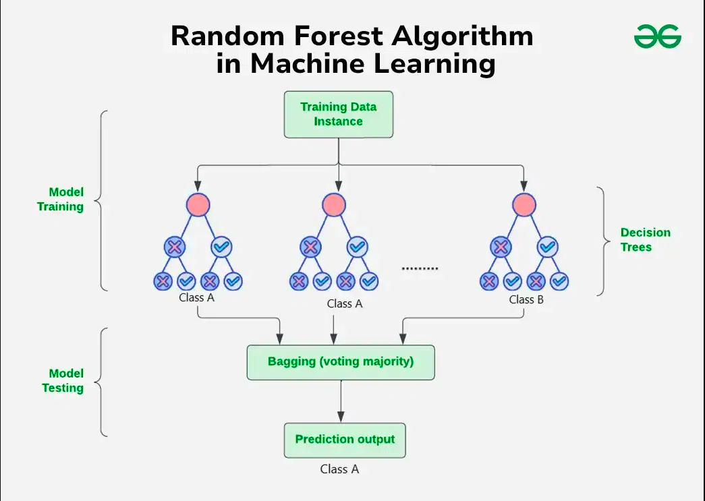
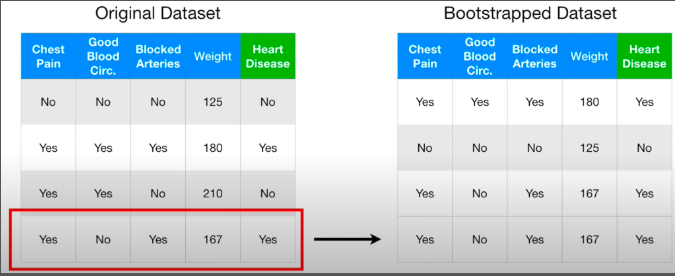

> **Lưu ý**
>
> Một số thuật ngữ liên quan đến thuật toán trong bài viết này sẽ không được dịch ra tiếng Việt
{:.block-warning}

# 1. Khái niệm về Random Forest
Giả sử trong tình huống bạn đang muốn mua một chiếc ô tô cho bản thân nhưng lại không biết lựa chọn hãng xe nào là hợp lí nhất. Vì chẳng biết rõ được mình nên chọn chiếc xe nào, bạn hỏi mọi người xung quanh mong chờ được tư vấn. Có rất nhiều đáp án mà họ có thể gợi ý, nhưng bạn để ý rằng là 7 trên 10 người trả lời rằng chiếc Honda Civic 2019 là phù hợp với bạn nhất nên bạn quyết cọc tiền mua chiếc xe ngay trong hôm đó. Nếu bạn để ý, hiện tượng thu thập ý kiến từ nhiều nguồn để đưa ra được quyết định cuối cùng qua số đông (majority voting) xảy ra rất thường xuyên trong cuộc sống; thậm chí nó còn có tên riêng luôn là *trí thông minh đám đông* (wisdom of the crowd). Thuật toán Random Forest (RF) chính xác là hoạt động dựa trên ý tưởng này, nhưng trong Machine Learning, nó được biến đến với thuật ngữ *bagging* thuộc một mảng to hơn là *ensemble*. Ensemble là kĩ thuật để gia tăng hiệu năng hay độ chính xác của thuật toán cũng như giúp model ít bị bias hay high variance (hay còn gọi là overfit). Mảng này chứa một số kĩ thuật khác, nhưng bài này sẽ chỉ nói về nhánh bagging của RF. <br>



Như tên gọi, RF là tập hợp nhiều cây quyết định và đưa ra kết quả theo số đông của các cây đó. Ví dụ trong bài toán dự đoán mail spam, thì nếu một model RF gồm 50 cây quyết định, trong đó có 40 cây cho kết quả là "spam" và 10 cây cho kết quả ngược lại, thì model sẽ dự đoán là "spam". Cách hoạt động thì đơn giản như vậy, nhưng RF còn có một số kĩ thuật khác để tăng hiệu quả của model cũng như "khỏe" (robust) hơn.

## 1.1. Kĩ thuật bagging
Như đã giới thiệu, bagging là một nhánh thuộc tập hợp các kĩ thuật ensemble learning để tăng hiệu quả của model. Điểm chung của bagging với các kĩ thuật khác (sẽ được giới thiệu ở một bài khác) là lấy một **model yếu** (weak learner) làm gốc, và cố gắng dùng một phương pháp để tăng hiệu quả của model đó. Điểm khác biệt chủ yếu của phương pháp này là nó train các weak learners **song song** với nhau, hay nói cách khác, là mỗi learner học một cách *độc lập* và kết quả của learner này không ảnh hưởng tới learner khác. Như vậy ta biết được RF là một ví dụ điển hình của bagging, nhưng tại sao một Decision Tree lại được xem là một weak learner? Nếu bạn đã xem một bài viết trước của tôi về cây quyết định thì sẽ thấy ví dụ đó nó hoạt động khá ổn, nhưng đó là khi ta sử dụng một bộ dataset nhỏ và ít nhiễu (noise). Decision Tree, như các thuật toán thô sơ khác như K-means, KNN; thì khá dễ bị ảnh hưởng bởi các outliers hay nhiễu trong bộ dữ liệu. Vì vậy, để giảm variance của cây thì ta sẽ dùng một tập hợp nhiều cây, tham khảo dự đoán của từng cây và đưa ra quyết định cuối cùng theo majority voting. Tính chất này cũng là ý tưởng chính của RF, nhưng không đơn giản như vậy. Vấn đề là nếu chúng ta cho các cây học trên cùng một dataset, thì chẳng phải chúng sẽ đưa ra kết quả giống nhau chăng? Kĩ thuật tiếp theo, *bootstrapping*, được sử dụng trong RF để giải quyết vấn đề này.

## 1.2. Kĩ thuật boostrapping
Bootstrapping ám chỉ việc ta tạo một dataset mới bằng cách **tổ hợp lặp** (combination with repetition) các điểm dữ liệu (sample) của dataset cũ. Giả sử ta có train dataset là $X$ với $n$ samples cùng với $Y$ là ground-truth của các samples đó. Sau khi bootstrap $X$, ta được $X_{bstrapped}$ và $Y_{bstrapped}$ cũng có $n$ samples là một bộ dữ liệu train mới. Khi đó:

$$
X_{bstrapped} \subseteq X
$$

Bởi vì khi ta chọn ngẫu nhiên có lặp lại dataset $X$ thì *có thể* sẽ có một số samples không được chọn và *có thể* một số bị lặp lại trong dataset mới. Với ví dụ hình dưới, sau quá trình bootstrapping thì ta có một dataset mới mà hoàn toàn không có điểm $x_3$ và có 2 điểm $x_4$. 



Vậy thì **tại sao lại cần boostrapping?** Có 2 lí do cho việc này. <br>

### Lí do thứ nhất

Trong thống kê, dữ liệu được chia ra thành $2$ tập hợp. Cái đầu tiên là *population*, nó ám chỉ dữ liệu mà ta cần giải quyết ở ngoài đời thật. Tập hợp thứ 2 là *sample* (không phải nghĩa *điểm dữ liệu* mà ta thường dùng) là tập hợp các điểm dữ liệu mà ta *đang có* (ví dụ như $X$ và $Y$). Vì sample so với population là rất nhỏ, ta không chắc được là nó có phản ánh đúng với population hay không nên ta sử dụng kĩ thuật bootstrapping. Người ta đã chứng minh được việc bootstrap sample ta đang có nhiều lần sẽ thu được dataset phản ánh giống với population mà ta muốn (công thức chứng minh sẽ không được đề cập trong bài này). Vì vậy việc sử dụng boostrapping giúp RF học trên bộ dữ liệu "thực" hơn và đạt được hiệu quả cao hơn.

### Lí do thứ hai

Có một hệ quả rất rõ ràng trong việc boostrapping này, đó là *loại bỏ nhiễu hoặc outliers*. Như ta đã biết, nhiễu khiến model nhạy cảm với nó dễ bị overfit hoặc có variance cao; hay nói ngắn gọn, là cho kết quả tệ. Tuy nhiên, nhiễu chỉ chiếm một phần nhỏ trong dataset, nên quá trình bootstrapping sẽ loại bỏ phần lớn hoặc *có thể* hoàn toàn nhiễu. Hệ quả là ta sẽ có kha khá dataset ít nhiễu và cũng đồng thời số lượng các samples "bình thường" được tăng lên, nên các cây được train trên các dataset này sẽ đưa ra dự đoán chính xác hơn. Dĩ nhiên, vì bootstrapping là ngẫu nhiên nên sẽ có thể có một dataset chứa một lượng lớn nhiễu, nhưng nên nhớ số lượng dataset dạng như vậy là rất ít nên các cây được train trên nhóm này sẽ không đóng góp được nhiều vào kết quả cuối.

### Lí do thứ ba: feature bagging

Còn một lí do nữa, cũng vì tôi chưa giới thiệu về kĩ thuật này. Có một kĩ thuật mà người ta dùng để tăng hiệu quả của RF đó chính là **feature bagging**. Nghĩa là để có được các bootstrapped dataset, ngoài việc chọn ngẫu nhiên có lặp lại các samples từ dataset cũ, ta cũng *chọn ngẫu nhiên không lặp lại* các features có trong bộ dataset cũ đó với số lượng ít hơn ở từng node. Nguyên nhân cho việc này là trong một dataset sẽ có một số features có tương quan và ảnh hưởng rất lớn tới kết quả của cây. Nếu RF được train với toàn bộ features cho từng node, nghĩa là vẫn dùng bootstrapped datasets cho các cây nhưng giữ toàn bộ features, thì các cây có thể sẽ tương tự nhau ở các tiêu chí split node. Điều này là không tốt vì ý tưởng của RF là muốn các weak learners phải không tương quan (decorrelated) thì mới đạt được kết quả tốt nhất phản ánh cho toàn bộ population. Nếu các cây ở mỗi node đều được sử dụng toàn bộ features thì các features mạnh sẽ chiếm ưu thế hơn nên gây ra hiện tượng các cây trong RF chẳng khác gì nhau mấy. Nên để loại bỏ điều này thì ở mỗi node, giả sử $X$ có $m$ features thì mỗi cây quyết định sẽ chỉ được dùng ngẫu nhiền $\sqrt{m}$ features của dataset đang xét (có thể chọn số khác, nhưng dùng căn bậc $2$ được cho là best practice).  

## 1.3. Out-of-bag metric

# 2. Tóm tắt thuật toán

# 3. Code thuật toán

Phần này tôi sẽ thử code lại thuật toán và so sánh kết quả với thuật toán RF của `sklearn`. Phần này sẽ chỉ bao hàm phần code cho `classifier`, model cho bài toán regression vui lòng tham khảo tại github cá nhân được đính kèm trong bài viết. Các thư viện hoặc module được `import` tùy theo từng phần, độc giả khi code có thể tự gom các câu lệnh `import` lên đầu.

## 3.1. Chuẩn bị dataset

Để gọn lẹ thì ta sẽ dùng toy dataset của `sklearn` về *breast cancer* (không tiện dịch) qua hàm `load_breast_cancer()`. Đây là dữ liệu cho bài toán classification với 2 class là 2 loại cancer. Ta cũng sẽ split tập train và test với tỉ lệ $(0.8:0.2)$ do đã có `oob accuracy` làm evaluation metric.

```python
from sklearn.datasets import load_breast_cancer
from sklearn.model_selection import train_test_split

X, Y = load_breast_cancer(return_X_y=True)
x_train, x_test, y_train, y_test = train_test_split(X, Y, test_size=0.1)
```

## 3.2. Các hàm cần thiết

### Bootstrapping

Vì ta sẽ phải thao tác đa phần là `numpy array` để tính toán, nên để chọn ngẫu nhiên các samples có lặp lại thì ta sẽ dùng `numpy.random.choice()` để chọn random $1$ array mới với $n$ samples gồm các indices của $X$. Ngoài ra ta còn phải lựa ra indices của các oob samples, điều này có thể dùng tính chất của *tập hợp* (set operations) qua `numpy.setdiff1d()` để tìm ra những indices không có trong tập bootstrapping dataset. Lí do cho việc chọn random indices là vì tính năng array slicing của `numpy` cho phép ta lấy samples chỉ với một array các indices tương ứng. Ta sẽ chỉ code hàm dùng cho một lần bootstrap tương ứng với một cây và hàm sẽ trả về tập train, tập oob để validate và các indices của oob tương ứng.

```python
import numpy as np

def bootstrap_dataset(X, Y):
    sample_indices = np.random.choice(len(X), len(X)) # bootstrap indices

    dataset_indices = np.arange(X.shape[0]) # mảng chứa indices của dataset gốc
    oob_indices = np.setdiff1d(dataset_indices, sample_indices) # tìm indices mà sample_indices không có

    return {
            "train_set": (X[sample_indices], Y[sample_indices]),
            "oob_set": (X[oob_indices], Y[oob_indices]),
            "oob_indices": oob_indices
        }
```

### Đưa kết quả

Thứ ta cần là một hàm predict dựa trên input đưa vào. Ta sẽ đặt `trees_list` là list chứa tất cả cây của RF, hàm predict sẽ lặp qua list và dùng hàm `predict()` của cây để lấy kết quả và `append()` vào list `outputs`. Nếu input đưa vào có shape `(n_samples, n_features)` với `n_samples` là số lượng input còn `n_features` là số lượng features mà tập train có, thì `outputs` sẽ có shape `(n_trees, n_samples)` với từng hàng là dự đoán của từng cây. Nhiệm vụ của hàm `predict()` mà ta đang code là trả về một array có shape `(n_samples,)` là dự đoán của RF với từng sample. Với bài toán classification mà ta đang giải quyết, ta sẽ thực hiện majority voting cho `n_trees` với từng sample qua hàm `scipy.stats.mode()`. Hàm này sẽ chọn ra giá trị xuất hiện nhiều nhất theo axis đang xét, trong trường hợp này là `axis=0` do mỗi hàng là một cây.

```python
from scipy.stats import mode

def predict(trees_list, X):
    outputs = list()

    for tree_t in trees_list:
        outputs.append(tree_t.predict(X))

    outputs = np.array(outputs) # chuyển list thành np.ndarray để thao tác, shape (n_trees, n_samples)

    return mode(outputs, axis=0).mode
```

### Training

Các hàm cơ bản giờ đã xong, giờ ta chỉ cần gom lại để tạo một hàm `fit()` cho training. Hàm này ngoài việc nhận `X` và `Y` là tập data để train thì còn nhận `T` là số cây cần train cho RF, tương tự `n_estimators` trong `sklearn`.

```python
def fit(T, X, Y):
    trees_list = list() # danh sách cây

    # khởi tạo list lưu oob predictions của các cây, list chứa n_samples list rỗng chứa oob predictions qua tất cả vòng lặp
    oob_list = [list() for _ in range(X.shape[0])] 

    for t in range(T):
        # lấy bootstrap dataset, oob dataset và oob indices
        bootstrapped_ds = bootstrap_dataset(X, Y) 
        train_X, train_Y = bootstrapped_ds["train_set"]
        oob_X, oob_Y = bootstrapped_ds["oob_set"]
        oob_indices = bootstrapped_ds["oob_indices"]

        # fit cây thứ t, chọn max_features="sqrt" để dùng tình năng feature bagging
        tree_t = DecisionTreeClassifier(max_features="sqrt", random_state=0)
        tree_t.fit(train_X, train_Y)
        trees_list.append(tree_t) # thêm cây đã train vào danh sách

        # dự đoán cho các samples oob
        oob_preds = list(tree_t.predict(oob_X))

        for i, oob_pred in enumerate(oob_preds):
            # thêm dự doán của samples thứ oob_indices[i] vào oob_list đúng với thứ tự của nó
            oob_list[oob_indices[i]].append(oob_pred)
```

### Tính oob accuracy

>**Lưu ý**
>
>Cách tính oob score này vẫn chưa giống với cách của `sklearn`
{:.block-warning}


Bước cuối thì ta chỉ cần tính oob accuracy làm metric để đánh giá model. Ở đây ta cần xử lí kĩ hơn do có thể mọi samples đều *được chọn* ở một vòng lặp nào đó, dẫn tới việc những samples đó không tồn tại trong bất cứ tập oob nào. Suy ra trong `oob_list` có thể có một `list` rỗng tương ứng với sample **luôn** được chọn khi bootstrapping. Các `list` rỗng này sẽ làm hàm `mode()` trả về `nan` và sẽ gây lỗi khi ta tính accuracy. Ta sẽ thêm một đoạn code vào cuối hàm `fit()` sau khi train xong.

```python
def fit(T, X, Y):
    trees_list = list() # danh sách cây

    # khởi tạo list lưu oob predictions của các cây, list chứa n_samples list rỗng chứa oob predictions qua tất cả vòng lặp
    oob_list = [list() for _ in range(X.shape[0])] 

    for t in range(T):
        .
        .
        .
        .
        .
    #--------------------------------------------------------------------------------------------#
    aggregated_oob_preds = np.array([mode(sample_pred).mode for sample_pred in self.oob_list]) # majority voting cho mỗi sample trong oob_list

    # đánh dấu tất cả vị trí không phải là nan (các samples có ít nhất 1 lần tồn tại trong tập oob)
    final_oob_indices = ~np.isnan(aggregated_oob_preds) 
    oob_score = accuracy_score(aggregated_oob_preds[final_oob_indices], Y[final_oob_indices]) # kết quả oob accuracy

    #--------------------------------------------------------------------------------------------#
```

>**Lưu ý**
>
>Phần code trong link github sẽ khác do đã được gộp thành một class
{:.block-warning}

# 4. Dùng `sklearn` và so sánh kết quả

## `sklearn` Random Forest
Để tạo một RF từ `sklearn` giống setting mà ta dùng cho phần code ở trên thì rất đơn giản chỉ với 3 dòng code.

```python
from sklearn.ensemble import RandomForestClassifier

sklearn_clf = RandomForestClassifier(max_features="sqrt", oob_score=True, random_state=0)
sklearn_clf.fit(x_train, y_train)
```

## So sánh kết quả

Với phần code đã được modulized trong link github thì ta có thể gọi ra để fit tương tự như với `sklearn`.

```python
from modules import model

test_clf = model.RandomForestClassifier(n_estimators=100)
test_clf.fit(x_train, y_train)
test_preds = test_clf.predict(x_test)
```

Khi tính `accuracy_score` thì hai RF cho kết quả tương tự nhau với cùng setting.

```python
print("Personal RF implementation accuracy: ", accuracy_score(y_test, test_preds)) # Output: "Personal RF implementation accuracy:  0.9473684210526315"
print("Sciki-learn RF implementation accuracy: ", accuracy_score(y_test, sklearn_preds)) #Output: "Sciki-learn RF implementation accuracy:  0.9473684210526315" 
```

# 5. Tài liệu tham khảo
[https://www.geeksforgeeks.org/random-forest-algorithm-in-machine-learning/](https://www.geeksforgeeks.org/random-forest-algorithm-in-machine-learning/)

[https://www.ibm.com/topics/bagging](https://www.ibm.com/topics/bagging)

[https://youtu.be/J4Wdy0Wc_xQ?si=T6lS2UHSyAoYQOde](https://youtu.be/J4Wdy0Wc_xQ?si=T6lS2UHSyAoYQOde)

[https://www.quantstart.com/articles/bootstrap-aggregation-random-forests-and-boosted-trees/#ref-wiki-random-forest](https://www.quantstart.com/articles/bootstrap-aggregation-random-forests-and-boosted-trees/#ref-wiki-random-forest)