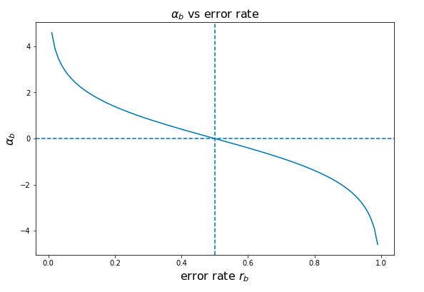
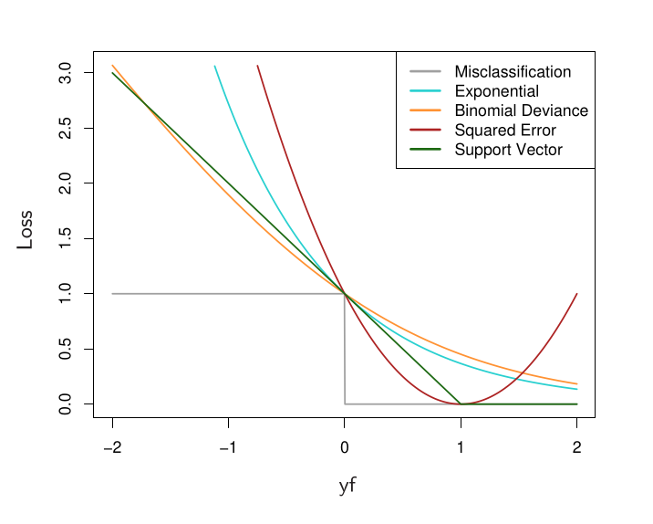

> **Lưu ý**
>
> Một số thuật ngữ liên quan đến thuật toán trong bài viết này sẽ không được dịch ra tiếng Việt
{:.block-warning}

# 1. Khái niệm về Adaptive Boosting (AdaBoost)
Giả sử bạn đang ôn môn Toán cho kì thi cuối kỳ. Trong lúc ôn thi bạn sẽ giải sai một số bài toán (khó), bạn sẽ làm gì tiếp theo? Tôi tin rằng đa phần sẽ xem lại hoặc làm lại bài toán đó cho tới khi hiểu và giải đúng, đó cũng chính là chiến thuật mà thuật toán Adaptive Boosting sử dụng. "Adaptive" mang nghĩa *thích nghi* hoặc *thích ứng*, ám chỉ base learner của model sẽ dần dần học và hiệu chỉnh theo các sai sót trong quá trình training ở vòng lặp trước đó. Từ từ đã, thuật toán học máy nào mà chẳng hiệu chỉnh để học tốt hơn? Thật ra, với AdaBoost thì từ *adaptive* mang nghĩa đen nhiều hơn khi nó học bám sát theo từng sample mà nó dự đoán sai ở vòng lặp trước đó. Nếu bạn đọc đã xem bài viết trước về Random Forest (RF) thì sẽ biết được có 2 điểm nổi bật của RF. Đó là *huấn luyện song song* và học trên bộ dữ liệu *thu thập ngẫu nhiên có lặp lại (bootstrapping)*. Điều này dẫn đến 2 vấn đề tương ứng mà AdaBoost giải quyết được:
   1. Huấn luyện song song bắt buộc mọi base learner không học được gì lẫn nhau. Lỗi ở learner này có thể gặp lại ở nhiều learners khác.
   2. Bootstrapping không đảm bảo model sẽ giải quyết được những samples mà base learner không học tốt.

AdaBoost chứa các yếu tố có thể giải quyết được 2 vấn đề này cũng như học tốt trên nhiều loại dataset khác nhau.

## 1.1 Kĩ thuật Boosting
Nếu như RF sử dụng kĩ thuật *bagging* làm mấu chốt, thì với AdaBoost ta biết được thêm một nhánh của kĩ thuật *ensemble* đó là *boosting*. Boosting là quá trình ta xây dựng một base learner mới hoặc phát triển thêm base learner đang có dựa trên lỗi hoặc kết quả từ base learner ở vòng lặp trước đó.Nói cách khác, learner thứ $m$ sẽ học dựa trên sai sót của learner thứ $m-1$ hoặc toàn bộ learners trước đó. Các thuật toán dựa trên boosting vì tính chất này mà các learners được xây dựng một cách **tuần tự**. Hệ quả là, trên lý thuyết, các learners được tạo sau sẽ khắc phục được lỗi của learners trước chúng và tựu chung toàn bộ model sẽ đạt kết quả tốt hơn. AdaBoost nổi tiếng với việc vào thời điểm đó là thuật toán có thể dùng một tập hợp các **weak** learners, những learners có kết quả chỉ tốt hơn dự đoán ngẫu nhiên, mà có thể đạt được kết quả của một classifier mạnh.

> **Lưu ý**
>
> Việc sử dụng strong learner làm base learner về mặt lý thuyết vẫn hoạt động. Nhưng model sẽ phải được điều chỉnh khác vì các learners quá mạnh có thể dẫn đến overfitting. Ngoài ra, tại sao phải boost learners mạnh khi nó đã đủ "mạnh" và việc boost weak learners nhanh hơn?
{:.block-warning}

## 1.2. Đánh trọng số mẫu dữ liệu
Với bài Decision Tree trước thì tôi giả định ta không sử dụng *sample weights* (trọng số mẫu dữ liệu) có thể điều chỉnh được bằng biến `sample_weight` trong hàm `fit`. Hay nói cách khác, là ta xem giá trị của mỗi sample là như nhau. Tuy nhiên, sample weights có thể được chỉnh để ảnh hưởng tới giá trị của sample cũng như thay đổi giá trị tách node của cây. Giả sử trong bài toán classification có 2 class $k$ là `0` và `1` với bộ dữ liệu có $N$ điểm, thông thường khi ta tính Gini Impurity cho 1 node $Q$ bất kì và hiện tại đang có $M$ điểm dữ liệu tại node đó thì công thức sẽ là:

$$
    Gini(Q) = 1 - \sum_{k=0}^{1} \sum_{i=1}^{M} \dfrac{1}{M} I(G(x_i)=k)
$$

trong đó $G(x_i)$ trả về class của điểm dữ liệu đó và hàm $I(G(x_i)=k)$ trả về $0$ nếu $x_i$ không thuộc class $k$ và $1$ nếu thuộc class $k$. Như vậy thì công thức thông thường này xem mọi sample có giá trị bằng nhau với việc ta sử dụng $\dfrac{1}{M}$ là giá trị của từng sample. Nếu ta sử dụng sample weights với một array $W$ tương ứng với $w_1$ chứa weight của $x_1$, $w_n$ cho weight của $x_n$ và $\sum_{i=1}^{N}w_i=1$. Như vậy công thức tính Gini mới sẽ là:

$$
    Gini(Q) = 1 - \sum_{k=0}^{1} \sum_{i=1}^{M} w_i I(G(x_i)=k)
$$

Như vậy, khi ta thay đổi sample weight cho một số samples thì cách chọn node của cây cũng bị ảnh hưởng, giả sử ta thay đổi sample weight sao cho class `0` có tổng weight lớn hơn class `1` rất nhiều dù số lượng ít hơn thì Gini cũng sẽ bị thay đổi đáng kể. Nói cách khác, qua sample weight ta có thể làm model chú ý hơn tới những sample "đặc biệt" này. AdaBoost chính xác là dự vào cơ chế này để giúp cây sau hoạt động tốt hơn cây trước. *Thuật toán sẽ giảm weight của các samples "không quan trọng", tức những sample mà learner trước đã đoán đúng, và tăng weight của các samples *quan trọng hơn*, tức những samples mà learner trước đoán sai.* Điều này giống như ví dụ ôn Toán ở trên, bạn có ôn lại (nhiều lần) những bài toán mà mình luôn làm đúng không? Vì chiến thuật đúng hơn vẫn là ôn những bài mà chúng ta làm sai nhiều hơn.

## 1.3. Biểu quyết có trọng số (weighted voting)

Khi ta đã hoàn thành việc training với AdaBoost, thứ ta nhận được không chỉ là một tập hợp các base learners (trong bài này sẽ là các cây quyết định) mà còn một tập hợp các trọng số $\alpha$ tương ứng mỗi cây. AdaBoost đưa ra kết quả cuối vẫn bằng phương pháp biểu quyết (majority voting) như RF, nhưng mỗi quyết định của các cây sẽ bị tác động bởi giá trị $\alpha$ tương ứng (sẽ nói rõ phần sau). Tập hợp giá trị $\alpha$ này có thể hiểu là "sức nặng" (amount of say) mỗi biểu quyết của mỗi cây. Giả sử một trường hợp ngoài đời, bạn cần mua một chiếc ô tô nhưng không biết chọn loại nào nên đi khắp nơi hỏi ý kiến mọi người. Bạn gặp 2 người, một người có 30 năm kinh doanh ô tô và anh ta cho rằng bạn nên mua một chiếc Honda, một người là streamer nổi tiếng, chưa có bằng lái và cho rằng bạn nên mua một chiếc Vinfast. Bạn sẽ tin ai? Rõ ràng người bán xe có lời khuyên có sức nặng lớn hơn, hay trong thuật ngữ AdaBoost là có giá trị $\alpha$ lớn hơn, do kinh nghiệm không thể chối cãi của anh ta. Thuật toán áp dụng nguyên lý y như vậy, base learner có kết quả tốt hơn và mạnh hơn thì đóng góp lớn hơn trong kết quả cuối.

# 2. Giải thích thuật toán

Như đã tiết lộ ở trên, AdaBoost giống Random Forest ở chỗ nó cũng tạo một tập hợp các learners và sau đó cho biếu quyết. Vấn đề khác mà ta cần giải quyết đó là AdaBoost sử dụng boosting nên (đại loại) các learners sau phải học trên kết quả của learners trước. Với RF, các cây học độc lập nên chúng ta không cần can thiệp nhiều trong quá trình tính loss và điều chỉnh theo thứ tự như boosting. Phần này sẽ diễn giải cách hoạt động của AdaBoost trong bài toán *phân loại nhị phân* (binary classification).

Trước hết, giả sử ta có một tập dữ liệu $X$ với $N$ samples, và tập targets $Y$ tương ứng. Trong đó $Y\in\set{-1,1}$ thay vì kí hiệu class $0$ và $1$ như thông thường. Thuật toán, được kí hiệu là hàm h(x), sẽ tạo một tập hợp các learners đã train $G=\set{g_1,g_2,...,g_M}$ có $M$ learners và một tập hợp $A=\set{\alpha_1,\alpha_2,...,\alpha_M}$ có $M$ trọng số tương ứng cho từng learner. Vậy để tổng hợp được quyết định cuối cùng thì

$$
\begin{equation}
\begin{aligned}
    G(x) &= \sum_{m=1}^{M}\alpha_m g_m(x) \\
    h(x) &= sign(G(x))
\end{aligned}
\end{equation}
$$

là công thức weighted voting cho AdaBoost với hàm $sign()$ sẽ cho $-1$ nếu nhận giá trị **âm** và $1$ nếu nhận giá trị **dương**. Ta sẽ đặt $f(x)=G(x)$. 

## 2.1. Hàm loss và tối ưu

Như mọi bài toán khác, ta cần một hàm loss. Hiện tại ta sẽ dùng hàm loss $L()$ được cho như sau, lí do sẽ giải thích phần sau.

$$
    L(y,f(x)) = exp(-y f(x)) 
$$

Cũng như mọi bài toán khác, với optimization thì ta cần tìm $min L(y,f(x))$ để kiếm được giá trị tối ưu cho thuật toán. Nghĩa là ta cần tìm 

$$
\begin{equation}
\begin{aligned}
    (A, G) &= argmin \sum_{i=1}^{N} L(y_i, f(x_i)) \\
    (A, G) &= argmin_{\alpha, g} \sum_{i=1}^{N} L(y_i, \sum_{m=1}^{M} \alpha_m g_m(x_i))
\end{aligned}
\end{equation}
$$

Như vậy để tối ưu được model theo cách thông thường sẽ rất tốn kém. Cứ thử tưởng tượng, với mỗi một vòng lặp mới ta cần phải tối ưu một lần, và mỗi lần tối ưu thì sẽ phải chỉnh toàn bộ parameters của các learners đã tạo và learner của vòng lặp này. Để khắc phục vấn đề này thì AdaBoost sử dụng một kiểu thuật toán khác gọi là *(Greedy) Forward Stagewise Additive Modeling* (FSAM).

Với FSAM, ta chỉ đơn giản là tối ưu learner của vòng lặp hiện tại và giữ nguyên các learners đã tạo trước đó. Như vậy, để tìm parameter tối ưu của learner thứ $m$ thì

$$
    (\alpha_m, g_m) = argmin_{\alpha,g} \sum_{i=1}^{N} exp(-y_i (f_{m-1}(x_i) + \alpha g(x_i))
$$

với $f_{m-1}$ khi khai triển ra sẽ là tổng kết quả các learners trước đó. Ta sẽ tiếp tục khai triển phía trong hàm $argmin$, trong phần tiếp theo tôi xin phép sử dụng $e$ thay vì $exp()$ vì trông nó đẹp hơn. Phần ta cần giải quyết là

$$
\begin{gather}
    \sum_{i=1}^{N} e^{-y_i (f_{m-1}(x_i) + \alpha g(x_i))} \\
    = \sum_{i=1}^{N} e^{-y_i f_{m-1}(x_i)} e^{-y_i \alpha g(x_i)}
\end{gather}
$$

trong đó, ta sẽ tạm đặt $w^{(m)}_i = e^{-y_i f_{m-1}(x_i)}$ vì cụm này chỉ là kết quả của mọi learners trước nên ta sẽ xem là một biến chưa thể can thiệp. Như vậy, ta sẽ có

$$
    \sum_{i=1}^{N} w^{(m)}_i e^{-y_i \alpha g(x_i)}
$$

Còn nhớ $Y\in \set{-1,1}$ chứ? Vì tính chất này mà ta suy ra được $2$ điểm:
   1. Nếu $y_i=g(x_i)$, thì $-y_i g(x_i) < 0$
   2. Nếu $y_i \neq g(x_i)$, thì $-y_i g(x_i) > 0$

Áp dụng $2$ tính chất này vào hàm trên, tạm gọi là $B(x, y)$ và giải thêm thì ta có

$$
\begin{equation}
\begin{aligned}
    B(x,y) 
    &= \sum_{y=g(x)} w^{(m)}_i e^{-\alpha} + \sum_{y \neq g(x)} w^{(m)}_i e^{\alpha} 
    \\
    &= e^{-\alpha} \sum_{i=1}^{N} w^{(m)}_i I(y_i = g(x_i)) + e^{\alpha} \sum_{i=1}^{N} w^{(m)}_i I(y_i \neq g(x_i))
\end{aligned}
\end{equation}
$$

Trong đó, hàm $I()$ trả về $1$ nếu điều kiện đúng và $0$ nếu sai. Theo cách kí hiệu như này, ta dùng tính chất $\sum_{i=1}^{N} I(y_i = g(x_i)) = \sum_{i=1}^{N} - \sum_{i=1}^{N} I(y_i \neq g(x_i))$ thì

$$
\begin{equation}
\begin{aligned}
    B(x,y) 
    &= e^{-\alpha} (\sum_{i=1}^{N} w^{(m)}_i - \sum_{i=1}^{N} w^{(m)}_i I(y_i \neq g(x_i))) + e^{\alpha} \sum_{i=1}^{N} w^{(m)}_i I(y_i \neq g(x_i)) \\
    &= e^{-\alpha} \sum_{i=1}^{N} w^{(m)}_i + (e^{\alpha}-e^{-\alpha}) \sum_{i=1}^{N} w^{(m)}_i I(y_i \neq g(x_i))
\end{aligned}
\end{equation}
$$

Tới đây ta sẽ đặt $T_w=\sum_{i=1}^{N} w^{(m)}_i$ là tổng weight và $Err_w=\sum_{i=1}^{N} w^{(m)}_i I(y_i \neq g(x_i))$ là tổng lỗi. Như vậy khi thế vào công thức tính loss cũ thì ta có

$$
    argmin_\alpha e^{-\alpha} T_w + (e^{\alpha}-e^{-\alpha})Err_w
$$

Để tìm giá trị $\alpha$ tối ưu thì ta đạo hàm và gán bằng $0$ để tìm cực tiểu

$$
\begin{equation}
\begin{aligned}
    \frac{\mathrm{d} L}{\mathrm{d}\alpha} 
    &= -e^{-\alpha}T_w + e^{\alpha}E_w + e^{-\alpha}E_w \\
    0 &= e^{-\alpha}(E_w-T_w) + e^{\alpha}E_w \\
    -e^{\alpha}E_w &= e^{-\alpha}(E_w-T_w) \\
    -e^{2 \alpha} &= \dfrac{E_w-T_w}{E_w} \\
    e^{2 \alpha} &= \dfrac{T_w-E_w}{E_w} \\
    2 \alpha &= ln \dfrac{T_w/T_w-E_w/T_w}{E_w/T_w} \\
    \alpha &= \dfrac{1}{2} ln \dfrac{1 - err_m}{err_m}
\end{aligned}
\end{equation}
$$

trong đó $\dfrac{1}{2}$ là constant nên ta có thể lược bỏ vì không ảnh hưởng nhiều đến kết quả. $err_m$ vẫn là tổng lỗi của learner thứ $m$ này sau khi đã được normalized với tổng weight, với công thức

$$
    err_m = \dfrac{\sum_{i=1}^{N} w^{(m)}_i I(y_i \neq g_m(x_i)}{\sum_{i=1}^{N} w^{(m)}_i}
$$

### Một tí về $\alpha$

**Ý chính:** $\alpha$ là log odds và tỉ lệ nghịch với $err_m$

Với công thức tính $\alpha$ mà ta đạt được, ngoại trừ constant $\dfrac{1}{2}$, ta thấy được $\alpha$ chính là $logodds$ từ kết quả train của base learner. Với $E_w$ là tổng weight của tất cả samples mà learner đoán sai, và $T_w$ là tổng weight của tất cá samples trong dataset ở vòng lặp hiện tại, thì $err_m = \dfrac{E_w}{T_w}$ là bước normalize tổng weight lỗi về range $[0,1]$. Hay nói cách khác, $err_m$ là *xác suất lỗi* và $1-err_m$ là *xác suất đúng*. Từ đó ta dễ dàng thấy được $\dfrac{1-err_m}{err_m}$ là odds, nên $\alpha$ là log odds. Dù $\alpha$ được suy ra từ những bước ta đã làm từ hàm loss, thì nó cũng cho ta thấy được amount of say của từng learner được đánh giá giống độ "uy tín" của một người. Nếu một người làm việc càng uy tín, giống một learner dự đoán càng chính xác, thì "trọng lượng" lời nói của người/learner đó sẽ cao hơn. Hình bên dưới cho ta thấy được điều đó, với mối tương quan của $err_m$ (trong hình là $r_b$) và $\alpha_m$ (trong hình là $\alpha_b$). Hình được trộm từ [nguồn này](https://phamdinhkhanh.github.io/deepai-book/ch_ml/Boosting.html).

Khi $err_m$ càng gần $0$, tức learner rất tốt, thì "trọng lượng" lời nói của learner đó sẽ càng cao. Khi $err_m$ càng gần $0.5$, tức learner không khác gì dự đoán ngẫu nhiên, thì $\alpha$ sẽ gần $0$. Vì ta không thể tin một người hoàn toàn không biết gì mà chỉ chọn ngẫu nhiên được.

Với trường hợp $err_m>0.5$ thì $\alpha<0$, $err_m$ càng tăng thì $\alpha_m$ càng giảm. Nếu xét về trọng lượng lời nói như phía trên, thì có vẻ trường hợp này không hợp lí, vì amount of say âm thì như thế nào? Còn nhớ ta định nghĩa ở trên là hàm cuối cùng mà thuật toán đưa ra là $h(x)=sign(G(x))$ chứ? Trong đó, $G(x)$ là *tổng dự đoán của các learners*. Giả sử ta đang dự đoán $x_1$, thì toàn bộ $M$ learners sẽ dự đoán cho $x_1$, nhân $\alpha$ tương ứng của nó cho kết quả dự đoán, và tổng lại toàn bộ đưa vào hàm $sign()$ để ra class cuối. Trong quá trình đó, giả sử $y_1=1$, $g_{23}()$ là một learner cực tệ có $\alpha_{23}=-1.2$. Một learner tệ như vậy thì khả năng rất cao $g_{23}(x_1)=-1$, vậy thì đóng góp của nó sẽ là $\alpha_{23} g_{23}(x_1)=1.2$, tức là kết quả *ngược với dự đoán* của nó. Như vậy thì ta thấy được kiểu quy định class với dạng aggregate như thế này thì trong trường hợp này vẫn hoạt động bình thường. Ta có thể hiểu là với một người nói gì cũng sai thì ta chỉ cần đi ngược lại lời họ nói là khả năng đúng rất cao, giống [như vầy](https://www.youtube.com/watch?v=0HQRjbhGlLI).

> Liên hệ giữa Forward Stagewise Additive Modeling và AdaBoost chỉ được phát hiện tận 5 năm sau khi AdaBoost được công bố   
{:.block-tip}

## 2.2. Cập nhật trọng số cho mỗi vòng lặp

Ở phần trên ta đã giới thiệu thêm một biến mới là $w_i^{(m)}$, thực chất là tổng output của tất cả learners trước $m$. Với việc ta đã tính được $\alpha_m$, giờ ta cần cập nhật $w_i^{(m)}$ cho vòng lặp tiếp theo. Nhớ công thức $w^{(m)}_i = e^{-y_i f_{m-1}(x_i)}$ chứ? Để cập nhật weight mới thì ta cần cộng kết quả của learner hiện tại, tức

$$
    w^{(m+1)}_i = w_i^{(m)} e^{-\alpha_m y_i g_m(x_i)}
$$

với $-y_i g_m(x_i)$ là kết quả của learner hiện tại, và có 2 trường hợp là $y_i = g_m(x_i)$ hoặc $y_i \neq g_m(x_i)$, suy ra

$$
\begin{equation}
\begin{aligned}
    -\alpha_m y_i g_m(x_i) 
    &= \alpha_m (I(y_i \neq g_m(x_i)) - I(y_i = g_m(x_i))) \\
    &= \alpha_m (I(y_i \neq g_m(x_i)) - (1 - I(y_i \neq g_m(x_i))) )\\
    &= \alpha_m (2 I(y_i \neq g_m(x_i)) - 1) \\
    &= 2 \alpha_m I(y_i \neq g_m(x_i)) - \alpha_m
\end{aligned}
\end{equation}
$$

thay công thức này vào phần tính weight cho vòng lặp tiếp theo thì ta có

$$
\begin{equation}
\begin{aligned}
    w^{(m+1)}_i 
    &= w_i^{(m)} e^{2 \alpha_m I(y_i \neq g_m(x_i)) - \alpha_m} \\
    &= w_i^{(m)} e^{2 \alpha_m I(y_i \neq g_m(x_i))} e^{- \alpha_m} \\
    &= w_i^{(m)} e^{\alpha_m I(y_i \neq g_m(x_i))}
\end{aligned}
\end{equation}
$$

do $2$ và $e^{-\alpha_m}$ chỉ nhân weight mới một giá trị nhất định nên ta có thể lược đi.

Tới bước này ta có thể rút ra được một số điểm quan trọng trong thuật toán. **Thứ nhất**, thuật toán tính amount of say, tức "giá trị" của learner tương ứng. Learner học càng tốt thì "giá trị" đó càng cao và ngược lại. **Thứ hai**, thuật toán sử dụng đại lượng $w_i^{(m)}$, là loss của tổng toàn bộ learners trước $m$, với dạng một weight tương ứng với mỗi sample. Đây chính là sample weight mà ta đã đề cập phần mở đầu, chi tiết hơn sẽ ở phần dưới. **Thứ ba**, sau mỗi vòng lặp, ta lại cập nhật weight của từng sample mà learner $m$ đoán sai với một lượng $e^{\alpha_m}$ còn những sample đoán đúng sẽ *không thay đổi*.  

## 2.3. Exponential loss

> $f(x)$ ở phần này là $\alpha g(x)$   
{:.block-warning}

Ở phần trên, ta đã chứng minh được cách hoạt động của AdaBoost trong việc tìm amount of say cho các learners từ công thức loss $L(y, f(x))=e^{-yf(x)}$. Vậy tại sao lại là công thức này? 

Với setting hiện tại, $yf(x)>0$ nếu learner đoán đúng và $yf(x)<0$ nếu đoán sai. Hàm loss mà ta cần phải có $2$ tiêu chí sau: 
   1. Phạt (nhiều) khi learner đoán sai và không phạt (hoặc phạt ít) khi learner đoán đúng
   2. Mức độ phạt (độ lớn loss) tỉ lệ thuận với $\alpha$ khi learner đoán sai, tỉ lệ nghịch với $\alpha$ khi learner đoán đúng

Về ý số 2 thì giống như một đứa trẻ hư mà bạn phải dạy dỗ. Đứa trẻ càng hư (càng tự tin và cố tình hư) thì cần phải dùng biện pháp càng "mạnh" thì mới dạy được; tương tự việc learner đã đoán sai mà còn có $\alpha$ lớn. 

Với những thông tin cơ bản như vầy thì ta có thể plot một số loss khác trên trục $yf(x)$. Hình được lấy từ sách *The Elements of Statistical Learning*:

> Hàm loss $L(y, f(x))=e^{-yf(x)}$ chính là hàm Exponential trong hình   
{:.block-tips}

Đường màu xám là hàm loss cơ bản nhất, khi nó hoàn toàn không trừng phạt những kết quả đúng ($yf(x)>0$). Tuy nhiên, với những kết quả sai thì nó phạt mọi kết quả với một lượng như nhau; điều này là không hợp với tiêu chuẩn ta đặt ra. Điều này có thể được sửa khi dùng Squared Error loss vì hàm này tăng tiến nhanh nhất khi kết quả càng lệch về trái. Tuy nhiên, Squared Error là không phải là hàm đơn điệu trên $(-\infty,\infty)$. Điều này sẽ làm kết quả học của model sai lệch do nó vẫn trừng phạt tỉ lệ thuật với độ lớn của $yf(x)$ khi $yf(x)>1$.

$3$ đường còn lại hợp lệ với yêu cầu của ta, dù vậy ta có thể thấy được hàm Exponential là hàm có tăng tiến khi learner đó sai nhanh nhất. Về mặt lí thuyết ta có thể dùng bất cứ hàm nào trong bộ $3$ này, nhưng rõ ràng việc trừng phạt lớn hơn khi learner đoán sai của hàm Exponential là tốt hơn. Vì vậy ta chọn $e^{-yf(x)}$ làm hàm loss cho thuật toán.

# 3. Tóm tắt thuật toán

Như vậy, AdaBoost hoạt động xoay quanh sample weight $w_i$ của từng sample và tinh chỉnh qua mỗi lần lặp với một lượng tương ứng. Tuy nhiên ở vòng lặp đầu tiên thì ta chưa có lượng weight đó, nên ta sẽ khởi tạo weight của mỗi sample là bằng nhau. Thuật toán sẽ được biểu diễn như sau:

   1. Nhận $X$ và $Y$ với $N$ samples
   2. Khởi tạo weight của từng sample $w_i=\dfrac{1}{N}$, $i=1,2,...,N$
   3. Lặp $M$ vòng lặp tương ứng $M$ learners. Trong mỗi vòng lặp:
      
      1. Fit learner $g_m(x)$ với tập X và dùng weight $w_i$ hiện có
      2. Tính lỗi $err_m = \dfrac{\sum_{i=1}^{N} w^{(m)}_i I(y_i \neq g_m(x_i)}{\sum_{i=1}^{N} w^{(m)}_i}$
      3. Tính $\alpha_m=log(\dfrac{1-err_m}{err_m})$
      4. Cập nhật weight mới cho từng sample với $w_i=w_i exp(\alpha_m I(y_i \neq g_m(x_i))$
   4. Cho ra model cuối cùng $G(x)=sign(\sum_{m=1}^{M}\alpha_m g_m(x))$ 

**Lưu ý:** ở bước $4$ trong vòng lặp khi ta cập nhật weight mới thì ở vòng lặp sau tổng weight sẽ không bằng $1$. Sẽ có nhiều nguồn hay có thêm bước normalize các weight về chuẩn xác suất.

# Tài liệu tham khảo
[Elements of Statistical Learning](https://link.springer.com/book/10.1007/978-0-387-84858-7)
[https://machinelearningtheory.org/docs/Boosting/adaboost/](https://machinelearningtheory.org/docs/Boosting/adaboost/)
